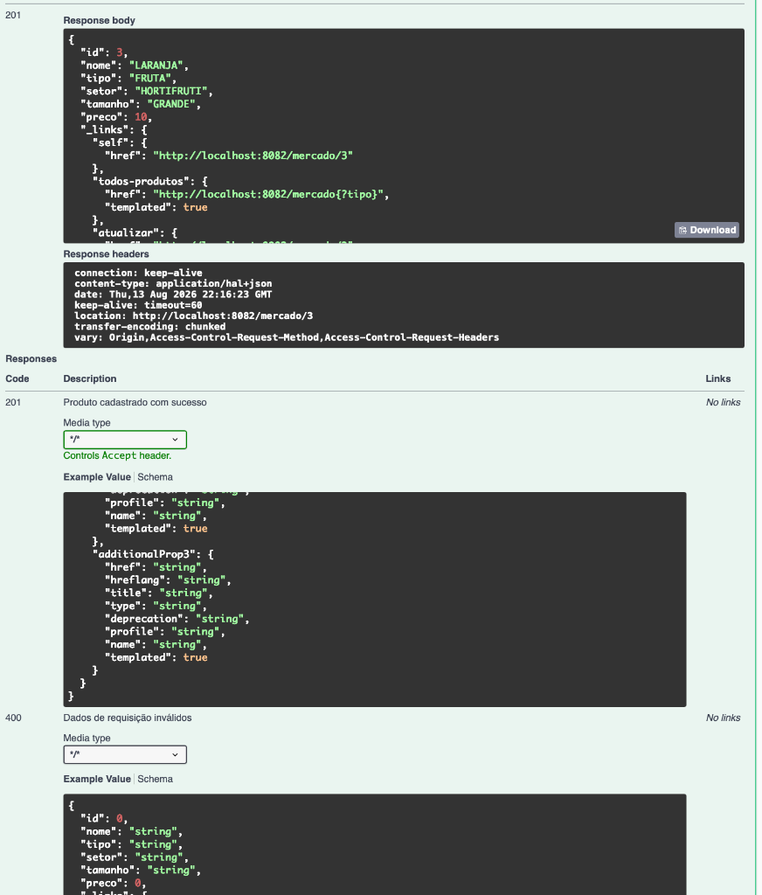
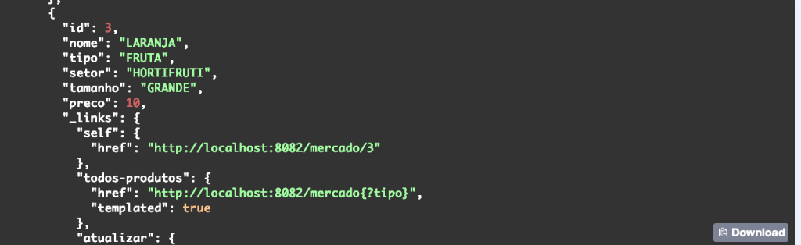
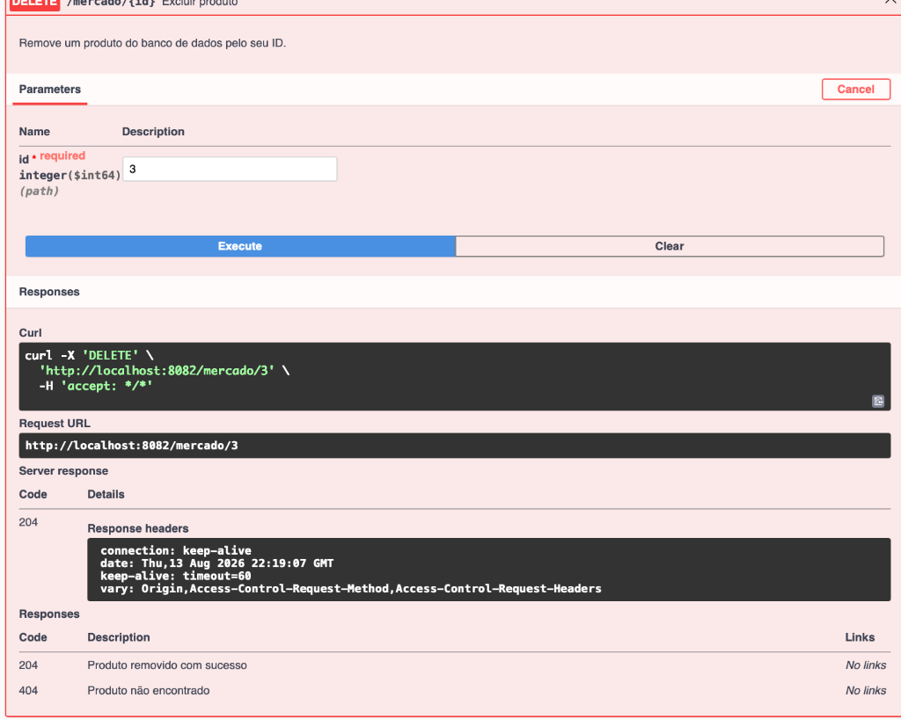

# 🛒 Mercado Express API — FIAP Checkpoint 4 (Parte 1)

> **API RESTful de Alta Maturidade (HATEOAS Nível 3) para Gestão de Estoque do Mercado Express**  
> **Framework:** Spring Boot 3.3 | **Linguagem:** Java 21 | **Persistência:** Spring Data JPA + Oracle DB / H2  
> **IDE Utilizada:** IntelliJ IDEA Ultimate Edition

---

## 👥 Integrantes do Grupo e RMs

| Nome do Integrante | RM |
| :--- | :--- |
| **Gabriel Maciel Alves de Oliveira** | **RM562795** |
| **Vitória Rodrigues Martins** | **RM565160** |
| **Augusto Bonomo Júnior** | **RM565155** |
| **Thomas Fontes** | **RM562254** |
| **Matheus Pereira Molina** | **RM563399** |

* **Repositório GitHub:** [https://github.com/Gabriel-Maciel06/CpJava4.git](https://github.com/Gabriel-Maciel06/CpJava4.git)
* **Link de Deploy da API (Azure VM):** [http://57.156.33.102:8082/swagger-ui.html](http://57.156.33.102:8082/swagger-ui.html)

---

## 📝 Descrição do Projeto

O **Mercado Express API** foi desenvolvido para atender às demandas de redes de mercados express de conveniência (venda de produtos de limpeza, hortifruti, vestuário/bazar, brinquedos, higiene e alimentos). 

A aplicação oferece um conjunto completo de endpoints **CRUD** (Create, Read, Update, Delete), implementando o **Nível 3 do Modelo de Maturidade de Richardson (HATEOAS)** com `RepresentationModelAssemblerSupport` (`MercadoModelAssembler`), permitindo que clientes da API naveguem dinamicamente pelos recursos por meio de hipermídias (`_links`).

---

## 📸 Evidências e Screenshots de Execução (Swagger UI & REST API)

### 1️⃣ Cadastro de Produto (`POST /mercado` — Status 201 Created & Header Location)


### 2️⃣ Retorno do JSON com Links HATEOAS (Maturidade Nível 3 de Richardson)


### 3️⃣ Exclusão de Produto por ID (`DELETE /mercado/{id}` — Status 204 No Content)


---

## 🛠️ Tecnologias e Ecossistema Spring Utilizados

- **Java 21 LTS** — Recursos modernos da linguagem.
- **Spring Boot 3.3.4 (Maven)** — Framework base para rápida configuração de microsserviços.
- **Spring HATEOAS** — Adição de navegação hipermídia com `RepresentationModelAssemblerSupport`.
- **Spring Data JPA & Hibernate** — Abstração e ORM para manipulação do banco de dados Oracle.
- **Lombok 1.18.46** — Produtividade com anotações (`@Getter`, `@Setter`, `@NoArgsConstructor`, `@AllArgsConstructor`, `@Builder`).
- **Spring Validation (Jakarta Validation)** — Validação declarativa de entrada de dados (`@NotBlank`, `@NotNull`, `@Positive`).
- **Oracle JDBC Driver (OJDBC11) / H2 Database** — Suporte ao banco Oracle FIAP com fallback transparente H2 em memória.
- **OpenAPI 3 / Swagger UI** — Documentação e testes interativos no navegador (`http://57.156.33.102:8082/swagger-ui.html`).
- **Docker & Docker Compose** — Conteinerização para deploy em nuvem na VM Azure.

---

## 🗄️ Estrutura da Tabela do Banco de Dados (`TDS_TB_MERCADO`)

A persistência de dados é realizada na tabela `TDS_TB_MERCADO` do banco Oracle FIAP.

```sql
CREATE TABLE TDS_TB_MERCADO (
    ID NUMBER(19) DEFAULT SQ_TDS_MERCADO.NEXTVAL PRIMARY KEY,
    NOME VARCHAR2(100) NOT NULL,
    TIPO VARCHAR2(50) NOT NULL,
    SETOR VARCHAR2(50) NOT NULL,
    TAMANHO VARCHAR2(30) NOT NULL,
    PRECO NUMBER(10, 2) NOT NULL,
    CONSTRAINT CK_PRECO_POSITIVO CHECK (PRECO > 0)
);
```

### Mapeamento dos Atributos
- **Id (`ID`)**: Identificador único numérico de incremento automático via `SQ_TDS_MERCADO`.
- **Nome (`NOME`)**: Descrição/nome comercial do produto (ex: Detergente Líquido 500ml).
- **Tipo (`TIPO`)**: Categoria do item (ex: Limpeza, Alimentos, Hortifruti, Brinquedos).
- **Setor (`SETOR`)**: Seção do mercado (ex: Higiene e Limpeza, Hortifruti, Bazar, Infantil).
- **Tamanho (`TAMANHO`)**: Especificação de porte/conteúdo (ex: 500ml, 1kg, Grande, Único).
- **Preço (`PRECO`)**: Valor unitário em reais (`BigDecimal`).

---

## 📡 Endpoints da API e Exemplos do CRUD

> **Servidor em Produção (Azure VM):** `http://57.156.33.102:8082`  
> **Servidor Local:** `http://localhost:8082`  
> **Porta Obrigatória:** `8082`

---

### 1️⃣ `GET /mercado` — Listar Todos os Produtos (com HATEOAS)
Retorna todos os produtos cadastrados com links HATEOAS.

**Requisição:**
`GET http://57.156.33.102:8082/mercado`

**Resposta (`200 OK`):**
```json
{
  "_embedded": {
    "produtos": [
      {
        "id": 1,
        "nome": "LARANJA",
        "tipo": "FRUTA",
        "setor": "HORTIFRUTI",
        "tamanho": "GRANDE",
        "preco": 10.0,
        "_links": {
          "self": {
            "href": "http://57.156.33.102:8082/mercado/1"
          },
          "todos-produtos": {
            "href": "http://57.156.33.102:8082/mercado"
          },
          "atualizar": {
            "href": "http://57.156.33.102:8082/mercado/1"
          },
          "atualizar-parcial": {
            "href": "http://57.156.33.102:8082/mercado/1"
          },
          "deletar": {
            "href": "http://57.156.33.102:8082/mercado/1"
          }
        }
      }
    ]
  },
  "_links": {
    "self": {
      "href": "http://57.156.33.102:8082/mercado"
    }
  }
}
```

---

### 2️⃣ `GET /mercado/{id}` — Consultar Produto por ID
Retorna os detalhes de um produto específico.

**Requisição:**
`GET http://57.156.33.102:8082/mercado/1`

**Resposta (`200 OK`):**
```json
{
  "id": 1,
  "nome": "LARANJA",
  "tipo": "FRUTA",
  "setor": "HORTIFRUTI",
  "tamanho": "GRANDE",
  "preco": 10.0,
  "_links": {
    "self": {
      "href": "http://57.156.33.102:8082/mercado/1"
    },
    "todos-produtos": {
      "href": "http://57.156.33.102:8082/mercado"
    },
    "atualizar": {
      "href": "http://57.156.33.102:8082/mercado/1"
    },
    "atualizar-parcial": {
      "href": "http://57.156.33.102:8082/mercado/1"
    },
    "deletar": {
      "href": "http://57.156.33.102:8082/mercado/1"
    }
  }
}
```

---

### 3️⃣ `POST /mercado` — Cadastrar Novo Produto (Create)
Cadastra um novo produto no banco de dados.

**Requisição:**
`POST http://57.156.33.102:8082/mercado`  
*Header:* `Content-Type: application/json`

**JSON de Entrada:**
```json
{
  "nome": "LARANJA",
  "tipo": "FRUTA",
  "setor": "HORTIFRUTI",
  "tamanho": "GRANDE",
  "preco": 10.0
}
```

**Resposta (`201 Created`):**
*Header Location:* `http://57.156.33.102:8082/mercado/1`
```json
{
  "id": 1,
  "nome": "LARANJA",
  "tipo": "FRUTA",
  "setor": "HORTIFRUTI",
  "tamanho": "GRANDE",
  "preco": 10.0,
  "_links": {
    "self": {
      "href": "http://57.156.33.102:8082/mercado/1"
    },
    "todos-produtos": {
      "href": "http://57.156.33.102:8082/mercado"
    },
    "atualizar": {
      "href": "http://57.156.33.102:8082/mercado/1"
    },
    "atualizar-parcial": {
      "href": "http://57.156.33.102:8082/mercado/1"
    },
    "deletar": {
      "href": "http://57.156.33.102:8082/mercado/1"
    }
  }
}
```

---

### 4️⃣ `PUT /mercado/{id}` — Atualizar Produto Completo (Update)
Substitui todas as informações de um produto existente.

**Requisição:**
`PUT http://57.156.33.102:8082/mercado/1`  
*Header:* `Content-Type: application/json`

**JSON de Entrada:**
```json
{
  "nome": "LARANJA SELECIONADA",
  "tipo": "FRUTA",
  "setor": "HORTIFRUTI",
  "tamanho": "GRANDE",
  "preco": 12.50
}
```

---

### 5️⃣ `PATCH /mercado/{id}` — Atualização Parcial
Altera pontualmente um ou mais atributos de um produto (ex: reajuste de preço).

**Requisição:**
`PATCH http://57.156.33.102:8082/mercado/1`  
*Header:* `Content-Type: application/json`

**JSON de Entrada:**
```json
{
  "preco": 11.90
}
```

---

### 6️⃣ `DELETE /mercado/{id}` — Excluir Produto (Delete)
Remove um registro do banco pelo ID.

**Requisição:**
`DELETE http://57.156.33.102:8082/mercado/1`

**Resposta (`204 No Content`):**
*(Corpo vazio)*

---

## 🚀 Como Executar o Projeto Localmente

### Pré-requisitos
- JDK 21+ instalado
- Apache Maven 3.8+

### Passos:
1. Clone este repositório:
   ```bash
   git clone https://github.com/Gabriel-Maciel06/CpJava4.git
   cd CpJava4/mercado-express-api
   ```
2. Compile e execute a aplicação:
   ```bash
   mvn spring-boot:run
   ```
3. A API estará acessível em `http://localhost:8082/mercado`.
4. Documentação Swagger UI: `http://localhost:8082/swagger-ui.html`
5. Console do Banco H2 (Modo Dev): `http://localhost:8082/h2-console`  
   - JDBC URL: `jdbc:h2:mem:mercadodb`
   - User: `sa` | Password: *(vazio)*

---

## ☁️ Deploy e Nuvem

A API foi conteinerizada via **Docker** e implantada na nuvem **Azure Virtual Machine** (`vm-linux-free`).
- **URL da API em Produção:** `http://57.156.33.102:8082/swagger-ui.html`
- **IP Público da VM:** `57.156.33.102`
- **Porta:** `8082`

---

## 📸 Configuração do Spring Initializr

Abaixo está o registro da configuração inicial do projeto com suas respectivas dependências:


