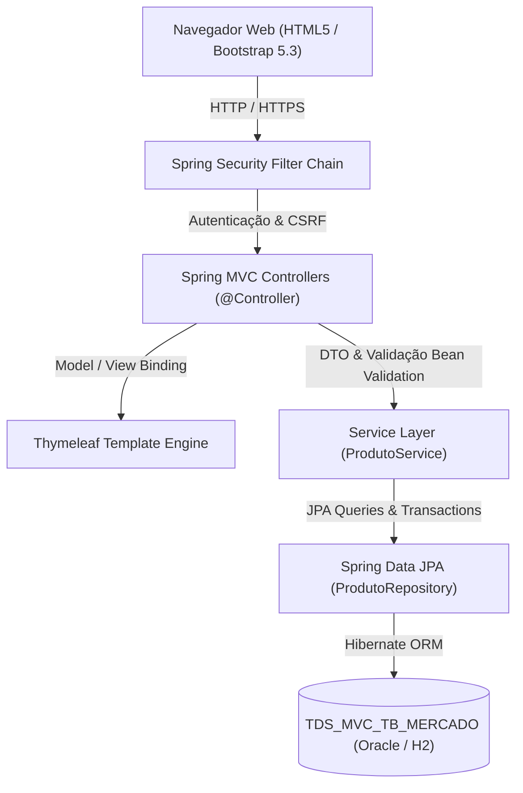

# 🛒 Mercado Express MVC — Checkpoint 4 (Parte 2: Spring Web, MVC, Security & Deploy)

Sistema Web corporativo para controle de catálogo, inventário e precificação de um **Mercado Express** (meias, produtos de limpeza, hortifruti, brinquedos, bebidas e padaria), desenvolvido com **Java 21**, **Spring Boot 3.3**, **Spring MVC**, **Thymeleaf**, **Spring Security 6** e persistência em banco relacional.

---

## 👥 Integrantes da Equipe
- **Gabriel Maciel Alves de Oliveira (RM562795)**
- **Vitória Rodrigues Martins (RM565160)**
- **Augusto Bonomo Júnior (RM565155)**
- **Thomas Fontes (RM562254)**
- **Matheus Pereira Molina (RM563399)**

---

## 🔗 Links Oficiais do Projeto
- **Repositório GitHub Oficial:** [https://github.com/Gabriel-Maciel06/cp4-java-mercado-express-mvc](https://github.com/Gabriel-Maciel06/cp4-java-mercado-express-mvc)
- **Link do Deploy em Produção (Nuvem Azure):** [http://mercado-express-rm562795.chilecentral.azurecontainer.io:8090](http://mercado-express-rm562795.chilecentral.azurecontainer.io:8090)
- **Sistema de Deploy Utilizado:** Microsoft Azure Container Instances (PaaS / Docker Linux Container)
- **IDE Utilizada para Elaboração do Projeto:** IntelliJ IDEA (compatível também com Eclipse e NetBeans via Maven)

---

## 🏛️ Arquitetura e Tecnologias Utilizadas



| Componente | Tecnologia | Função no Sistema |
| :--- | :--- | :--- |
| **Linguagem & Runtime** | Java 21 LTS | Plataforma principal de desenvolvimento |
| **Framework Base** | Spring Boot 3.3.4 | Injeção de dependências e autoconfiguração |
| **Arquitetura Web** | Spring MVC (`@Controller`) | Manipulação de requisições, rotas e redirecionamentos |
| **Template Engine** | Thymeleaf 3 | Renderização dinâmica de HTML server-side com layout fragments |
| **Segurança** | Spring Security 6 | Controle de acesso por rotas e perfis (`ROLE_ADMIN`, `ROLE_USER`) |
| **Persistência** | Spring Data JPA / Hibernate | Mapeamento Objeto-Relacional da tabela `TDS_MVC_TB_MERCADO` |
| **Banco de Dados** | Oracle DB / H2 In-Memory | Armazenamento relacional com suporte a fallback de conexão |
| **Validação** | Jakarta Bean Validation | Validação de formulários no servidor com mensagens amigáveis |
| **Produtividade** | Project Lombok | Redução de boilerplate (Getters, Setters, Builders) |
| **Design Front-End** | Bootstrap 5.3 + Icons | Interface responsiva, moderna e intuitiva com badges coloridos |

---

## 🗄️ Estrutura da Tabela no Banco de Dados (`TDS_MVC_TB_MERCADO`)

```sql
CREATE TABLE TDS_MVC_TB_MERCADO (
    ID BIGINT GENERATED BY DEFAULT AS IDENTITY PRIMARY KEY,
    NOME VARCHAR(120) NOT NULL,
    CATEGORIA VARCHAR(30) NOT NULL,
    CODIGO_BARRAS VARCHAR(30),
    PRECO NUMERIC(10,2) NOT NULL,
    ESTOQUE INTEGER NOT NULL,
    DESCRICAO VARCHAR(300),
    DATA_CADASTRO TIMESTAMP NOT NULL
);
```

---

## 🔒 Segurança e Perfis de Acesso (Spring Security)

A aplicação conta com autenticação personalizada via formulário estilizado em Thymeleaf (`/login`) e controle de acesso baseado em Roles:

| Usuário | Senha | Perfil (Role) | Permissões |
| :--- | :--- | :--- | :--- |
| `admin` | `admin123` | `ROLE_ADMIN`, `ROLE_USER` | Acesso total: Listar, Cadastrar, Editar e **Excluir** produtos |
| `operador` | `operador123` | `ROLE_USER` | Acesso operacional: Listar, Cadastrar e Editar produtos |

### Matriz de Rotas:
- **Rotas Públicas:** `/login`, `/css/**`, `/js/**`, `/images/**`, `/webjars/**`
- **Rotas Operacionais (Autenticados):** `/`, `/dashboard`, `/produtos`, `/produtos/novo`, `/produtos/salvar`, `/produtos/editar/**`, `/produtos/detalhes/**`
- **Rotas Administrativas:** `/produtos/excluir/**` (Exclusivo para `ROLE_ADMIN`. Usuários sem permissão são redirecionados para a tela de **Acesso Negado 403**).

---

## 📱 Guia das Telas e Operações CRUD

### 1. Dashboard Inicial (`/` ou `/dashboard`)
- Exibe métricas consolidadas em tempo real:
  - **Total de Produtos Cadastrados**
  - **Itens com Estoque Baixo (≤ 5 unidades)**
  - **Patrimônio Total em Estoque (R$)**
- Acesso rápido para cadastro e listagem.

### 2. Catálogo e Listagem de Produtos (`/produtos` - READ)
- Tabela interativa com cores dinâmicas por categoria:
  - 🧼 *Higiene e Limpeza* (Azul)
  - 🍎 *Hortifruti / Alimentos* (Verde)
  - 🧦 *Vestuário & Moda* (Roxo)
  - 🎲 *Brinquedos & Lazer* (Laranja)
  - 🧃 *Bebidas* (Verde Petróleo)
  - 🥖 *Padaria & Confeitaria* (Amarelo Ouro)
- Busca por nome e filtro avançado por categoria.
- Botões de ação para **Ver Detalhes**, **Editar** e **Excluir** com modal de confirmação.

### 3. Cadastro e Edição (`/produtos/novo` e `/produtos/editar/{id}` - CREATE / UPDATE)
- Formulário intuitivo com validação Bean Validation em linha (`@NotBlank`, `@Positive`, `@Min`, `@Pattern`).
- Exibição de mensagens de erro específicas sob cada campo incorreto.

### 4. Visualização de Detalhes (`/produtos/detalhes/{id}` - READ)
- Card detalhado contendo precificação, estoque restante, código EAN-13, data de inclusão e especificações técnicas.

### 5. Exclusão Física (`/produtos/excluir/{id}` - DELETE)
- Exclusão do registro no banco de dados com feedback instantâneo via *Flash Messages*.

---

## 💻 Como Executar o Projeto na sua IDE

### Opção 1: IntelliJ IDEA (Recomendada)
1. Abra o IntelliJ IDEA ➔ **File ➔ Open** e selecione a pasta do projeto `CP4-Java-Parte2-MVC`.
2. O IntelliJ identificará automaticamente o `pom.xml` e baixará as dependências Maven.
3. Localize o arquivo `src/main/java/com/fiap/mercadoexpressmvc/MercadoExpressMvcApplication.java`.
4. Clique com o botão direito ➔ **Run 'MercadoExpressMvcApplication'**.
5. Acesse no navegador: `http://localhost:8090`.

### Opção 2: Eclipse / STS (Spring Tools Suite)
1. **File ➔ Import ➔ Existing Maven Projects** e selecione a pasta do projeto.
2. Aguarde a sincronização do Maven.
3. Clique com o botão direito no projeto ➔ **Run As ➔ Spring Boot App**.
4. Acesse: `http://localhost:8090`.

### Opção 3: NetBeans
1. **File ➔ Open Project** e selecione o diretório.
2. Clique com o botão direito no projeto ➔ **Run**.

---

## 🐳 Execução via Docker / Nuvem

```bash
# 1. Build da Imagem
docker build -t mercado-express-mvc .

# 2. Execução do Container
docker run -p 8090:8090 mercado-express-mvc
```
Acesse `http://localhost:8090` no seu navegador!
